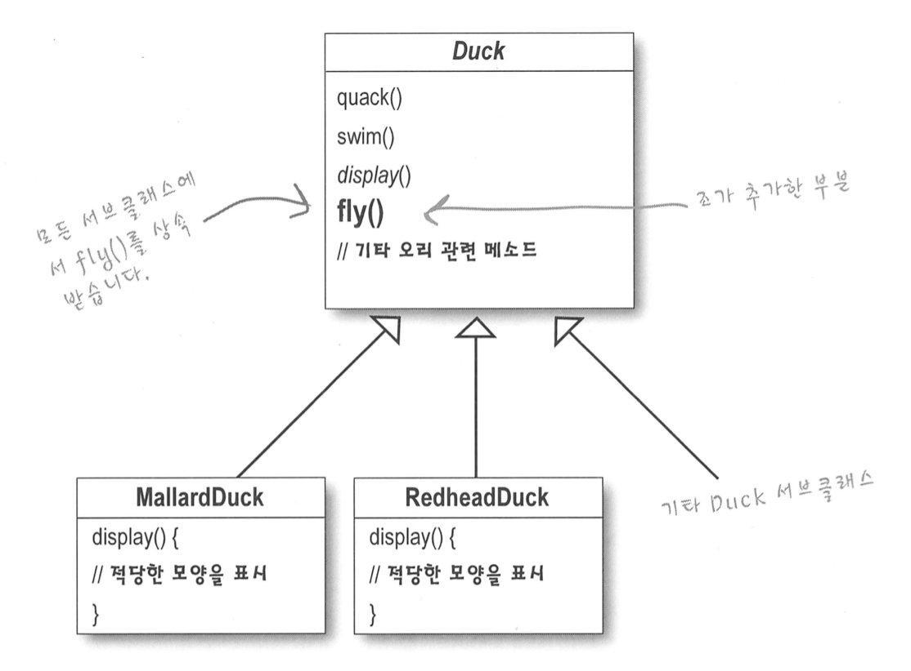
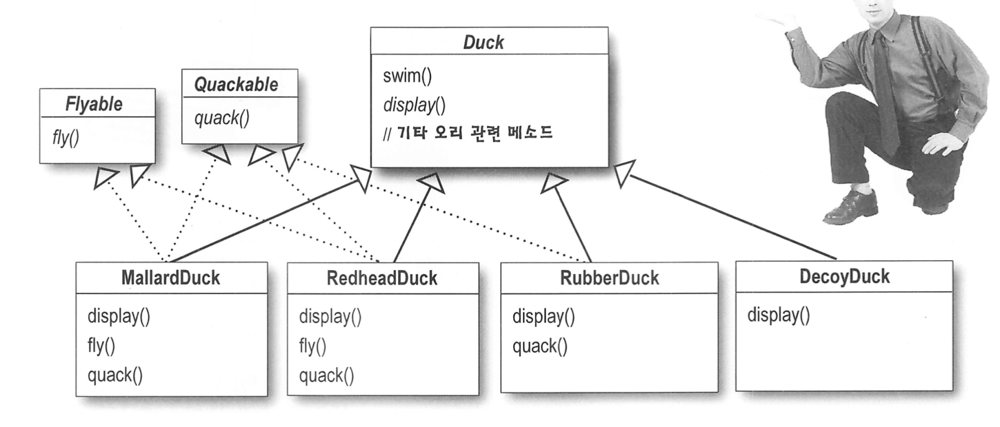
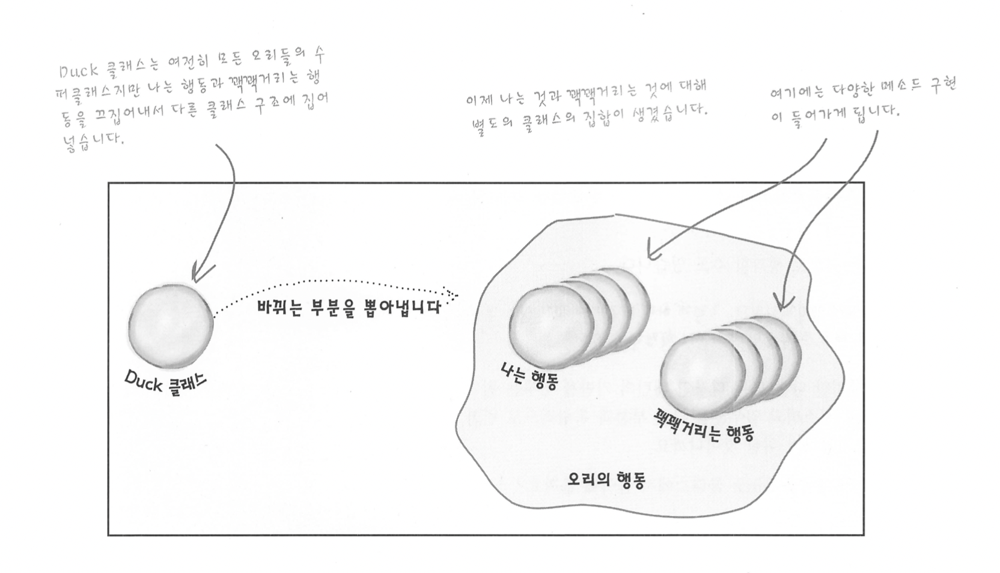
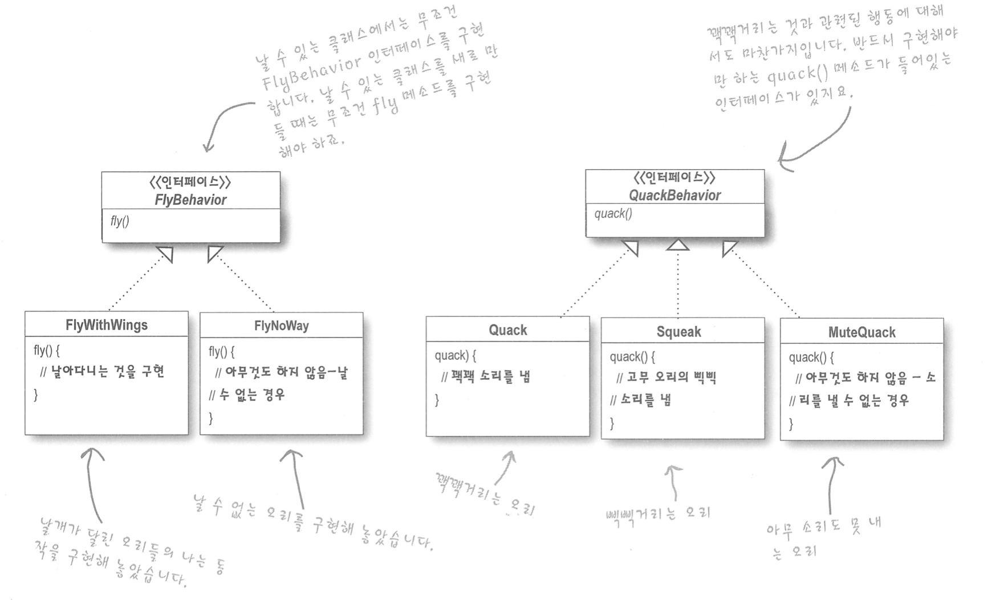

# Strategy Pattern

## 예시 - 오리

### 방법 01 - extends

- 상속만 진행 할 경우 발생 할 수 있는 문제
  - 슈퍼클래스 Duck 에 신규 모든 서브클래서에서 사용하지 않는 기능을 추가하게 될 경우
    - RubberDuck 은 fly가 필요 없다. 
    - DecoyDuck 은 꽉꽉 할 필요 없다.
      - 오버라이드 하여 행위에 대한 정의를 삭제 해야한다.
- 다른 행위 적용 케이스가 많이 질 경우 상속은 재사용성 측면에서는 좋을 수 있으나, 유지 보수 측면에서 좋지 않다.
    
### 방법 02 - interface

- fly 와 quack 을 인터페이스로 구현 한다면?
  - 인터페이스에는 구현된 코드가 들어가지 않기 때문에 코드 재사용을 전혀 기대 할 수 없다.
  - 액션을 바꿀 때마다 서로 다른 서브클래스들을 찾아 다 고쳐야 하기 때문에 코드 관리 측면에서 문제가 발생 한다.

## TODO
- 요구사항이 있을 때마다 바뀌는 부분이라면 바뀌지 않는 부분에서 골라내 분리해야 한다.
- 빠뀌는 부분을 뽑아 캡슐화 시켜야 바뀌지 않는 부분에 영향을 주지 않고 확장 할 수 있다.</br>

- 소프트웨어 개발에 있어서 바뀌지 않는것은 항상 **변한다**는것이다. </br>
  어플리케이션을 아무리 잘 디자인해도 시간이 지나면서 성장하고 변화해야한다.</br>
  그렇지 않으면 그 애플리케이션은 죽고 만다.
## 디자인 원칙-애플리케이션에서 달라지는 부분을 찾아 내고, 달라지지 않는 부분으로부터 분리 시킨다.


## 디자인 원칙-구현이 아닌 인터페이스에 맞춰서 프로그래밍한다.
- 이제부터 Dcuk의 행동은 (특정 행동 인터페이스를 구현한) 별도의 클래스 안에 들어가게 된다.
- Duck 클래스에서는 그 행동을 구체적으로 구현하는 방법에 대해 알고 있을 필요가 없다.
- **인터페이스에 맞춰서 프로그래밍 한다.** 는 **상위 형식에 맞춰서 프로그래밍한다.** 는 것을 의미안하.
  - 실제 실행시 쓰이는 객체가 코드에 의해서 고정되지 않도록 한다.
  - supertype 에 맞춰서 프로그래밍 하며 다형성을 활용해야 한다는 뜻이다.
  - 변수를 선언할 때 추상 클래스나 인터페이스 같은 supertype 으로 선언해야한다.
    - 어떤 객체든 집어 넣을 수 있기 때문
    - 변수를 선언하는 클래스에서 실제 객체의 형식을 몰라도 된다.
```java
// 예시
Dog d = new Dog();
d.bark();

// 인터페이스 / super type 적용
Animal animal = new Dog();
animal.makeSound();

// 더 바람 직한 supertype 인스턴스 구현
a = getAnimal();
a.makeSound();
```

### 방법 03 - Strategy Pattern

- 다른 형식의 객체에서도 나는 행동과 꽥꽥 거리는 행동을 재사용할 수 있다.
- 기존의 행동 클래스를 수정하거나 날아다니는 행동을 사용하는 Duck 클래스를 손대지 않고도 새로운 행동을 추가할 수 있다.
- package strategy_pattern.after_01 의 소스들을 살펴보자

## "A는 B이다" 보다 "A는 B가 있다" 가 나을 수 있다.
- 오리에게는 FlyBehavior와 QuackBehavior 가 있고 각각 행동과 꽥꽥 거리는 행동을 위임 받았다.
- 두 클래스를 이렇게 합치는것을 **구성(composition)**을 이용하는것이라 부른다.
  - 유연성을 크게 향상 시킬 수 있다.
  - 알고리즘을 별도의 클래스 집합으로 캡슐화 할수 있다.
  - 수성요소를 사용하는 객체에서 올바른 행동 인터페이스를 구현하기만하면 실행시에 행동을 바꿀 수도 있게 해준다.
  
## 디자인 원칙-상속보다는 구성을 활용한다.

## 스트래티지 패턴(Strategy Pattern)에서는
- 알고리즘군을 정의하고 각각을 캡슐화하여 교환해서 사용할 수 있도록 만든다.
- 스트래티지 을 활용하면 알고리즘을 사용하는 클라이언트와는 독립적으로 알고리 즘을 변경할수 있다.