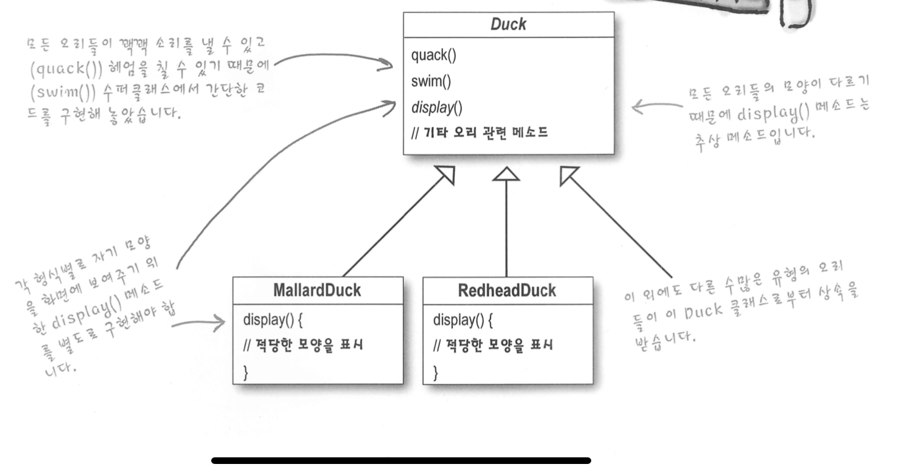
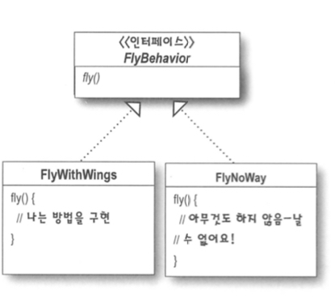

# Strategy Pattern

## 예시 - SimUDuck 오리

- 오리 나는 행동 추가 필요

### 방법 01 - 상속 extends

- 기존 quack() 메소드에서 했던 것과 동일하게 fly()메소드도 오버라이드를 할 경우
  - 서비 클래스에서 중복코드가 발생한다. -> 오리별로 오버라이드를 해줘야한다.
  - 모든 오리의 행동을 알 수가 없다. -> 오리별로 특성을 알 수 없으니 코드를 하나씩 확인해야 알 수 있다.
  - 코드를 변경했을 때 다른 오리한테 원치 않는 영향을 끼칠 수 있다. -> 처음에 없던 fly가 생김으로써 다른 무생물 오리한테 영향을 주었다.

### 방법 02 - interface

- flyable, Quackable 인터페이스를 만들어서 사용할 경우
  - 코드 중복이 발생하고 기존 코드를 전부 고쳐야한다.
  - 행동에 대한 코드 재사용을 기대할 수 없게 되므로 유지보수에 문제가 발생한다.

## 디자인 원칙

- 애플리케이션에서 달라지는 부분을 찾아내고, 달라지지 않는 부분으로부터 분리시킨다.
  - 모든 패턴은 시스템의 일부분을 다른 부분과 독립적으로 변화시킬 수 있는 방법을 제공하는 것이다.
  - 달라지는 부분을 찾아서 나머지 코드에 영향을 주지 않도록 "캡슐화"한다.
    - 코드를 변경하는 과정에서 의도하지 않은 일이 일어나는 것을 줄이면서 시스템의 유연성은 향상시킬 수 있다.

## Strategy Pattern 사용

1. 바뀌는 부분과 그렇지 않은 부분 분리하기
   
   - fly() 와 quack()은 Duck 클래스에서 오리마다 달라지는 부분이다.
   - 행동을 Duck 클래스로부터 갈라내기 위해서 각 행동을 나타낼 클래스 집합을 새로 만들도록 한다.
2. 오리의 행동 디자인
   
   - 인터페이스에 맞춰서 프로그래밍한다.
     - 상위 형식에 맞춰서 프로그래밍한다.
     - 실제 실행시에 쓰이는 객체가 코드에 의해서 고정되지 않도록, 어떤 상위 형식에 맞춰서 프로그래밍함으로써 다형성을 활용해야 한다.
     - 변수를 선언할 때는 보통 추상 클래스나 인터페이스 같은 상위 형식으로 선언해야 한다.
     - 객체를 변수에 대입할 때 상위 형식을 구현한 형식이라면 어떤 객체든 집어 넣을 수 있기 때문이다.
     - 변수를 선언하는 클래스에서 실제 객체의 형식을 몰라도 된다.
  - Duck의 행동의 (특정 행동 인테페이스를 구현한) 별도의 클래 안에 들어간다.
  - Duck 클래스에서는 그 행동을 구체적으로 구현하는 방법에 대해서는 더 이상 알 필요가 없다.

```java
// 예시 
Dog d = new Dog();
d.bark();

// 인터페이스 / super type 적용
Animal animal = new Dog();
animal.makeSound();

// 더 바람 직한 supertype 인스턴스 구현
a = getAnimal();
a.makeSound();
```

3. Duck의 행동을 구현하는 방법

- 다른 형식의 객체에서도 나는 행동과 꽥꽥 거리는 행동을 재사용할 수 있다.
- 기존의 행동 클래스를 수정하거나 날아다니는 행동을 사용하는 Duck 클래스를 손대지 않고도 새로운 행동을 추가할 수 있다.

4. Duck 행동 통합하기
   1. Duck 클래스에 flyBehavior 와 quackBehavior 라는 두 개의 인터페이스 형식의 인스턴스 변수를 추가한다.
      - 각 오래 객체에서는 실행시에 이 변수에 특정 행동 형식(FlyWithWings, Squeack 등) 에 대한 레퍼런스를 다형적으로 설정한다.
      - Duck 클래스 및 모든 서브 클래스에 fly(), quack() 메소드를 제거하고 Duck 클래스에 performFly(), performQuack()이라는 메소드를 집어넣는다.
   2. performQuack() 구현
   3. flyBehavior, quackBehavior 인스턴스 변수를 설정한다.

## "A는 B이다" 보다 "A는 B가 있다" 가 나을 수 있다.
- 오리에게는 FlyBehavior와 QuackBehavior 가 있고 각각 행동과 꽥꽥 거리는 행동을 위임 받았다.
- 두 클래스를 이렇게 합치는것을 **구성(composition)**을 이용하는것이라 부른다.
  - 유연성을 크게 향상 시킬 수 있다.
  - 알고리즘을 별도의 클래스 집합으로 캡슐화 할수 있다.
  - 수성요소를 사용하는 객체에서 올바른 행동 인터페이스를 구현하기만하면 실행시에 행동을 바꿀 수도 있게 해준다.

## 스트래티지 패턴(Strategy Pattern)에서는
- 알고리즘군을 정의하고 각각을 캡슐화하여 교환해서 사용할 수 있도록 만든다.
- 스트래티지 을 활용하면 알고리즘을 사용하는 클라이언트와는 독립적으로 알고리 즘을 변경할수 있다.